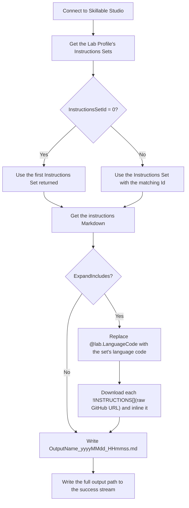

# Get-Instructions

Extract-Instructions pulls the lab instructions for a Lab Profile out of Skillable Studio and saves them as a local Markdown file. It can optionally resolve `!INSTRUCTIONS[](...)` include directives by downloading each referenced raw GitHub Markdown file and inlining it, so the saved file contains the complete instructions a learner would see.

The tool ships in three forms: a command-line script, a SAPIEN PowerShell Studio GUI form, and an MSI installer that packages the GUI as a standalone executable.

| | |
|---|---|
| **Author** | Wayne Klapwyk (WKUtils) |
| **Installer version** | 1.0.3.0 |
| **Built with** | SAPIEN PowerShell Studio 2026 v5.10.272 |
| **Runtime** | Windows PowerShell 5.1 |

## Contents

| File | Purpose |
|---|---|
| `Extract-Instructions.ps1` | The worker script. Connects to Skillable Studio, retrieves the requested Instructions Set, optionally expands GitHub includes, and writes the Markdown file. Can be run on its own from a console or called by another script. |
| `Extract-Instructions.psf` | SAPIEN PowerShell Studio form. Provides a GUI for picking a Lab Profile, Instructions Set, and output folder, then launches `Extract-Instructions.ps1` in a child process and streams its output into the window. Opening or editing this file requires PowerShell Studio. |
| `Extract-Instructions.msi` | Installer for the compiled GUI. Installs `Extract-Instructions.exe`, its `.exe.config`, and `Extract-Instructions.ps1`, and creates desktop and Start menu shortcuts named **WKUtils Extract-Instructions**. |

## Prerequisites

- Windows with Windows PowerShell 5.1. The GUI launches the worker script with `%WINDIR%\System32\WindowsPowerShell\v1.0\powershell.exe` specifically, not PowerShell 7.
- The Skillable **LOD.Core** PowerShell module, installed so it auto-loads. The script uses `Connect-LabOnDemand`, `Get-LODLabProfileInstructionsSets`, and `Get-LODLabProfileInstructions`, and the GUI also uses `Get-LODSessionToken`.
- A Skillable Studio account with access to the Lab Profiles you want to extract.
- Outbound HTTPS to `raw.githubusercontent.com` if you use include expansion.
- SAPIEN PowerShell Studio, only if you need to run the `.psf` directly or rebuild the executable and MSI.

## How it works



When include expansion is on, the script first replaces every `@lab.LanguageCode` token with the Instructions Set's `LanguageShortName`. This lets include URLs that contain a language folder resolve to the correct translated file. It then finds every include directive, downloads each unique URL once, and replaces the directive line with the downloaded content.

Include directives are matched case-insensitively and may have spaces inside or around the brackets (`!INSTRUCTIONS[](...)`, `!instructions [ ](...)`). Each directive must sit on its own line, and the URL inside it must be a `https://raw.githubusercontent.com/...` address.

## Usage

### GUI (installed)

1. Run `Extract-Instructions.msi` and accept the default folder (`C:\Program Files\WKUtils\Extract-Instructions`) or choose another.
2. Launch **WKUtils Extract-Instructions** from the desktop or Start menu. The form connects to Skillable Studio when it opens, and the Connection panel turns green once you are signed in.
3. Type a **Lab Profile Id** and tab out of the field. The **Instructions Sets** list fills with every set on that profile, shown as `Id: (DisplayId) - language: Name`.
4. Pick an Instructions Set.
5. Check **Resolve GitHub Includes** if you want include directives expanded. It is unchecked by default.
6. Confirm the **Extract to Folder** path, or use the `...` button to change it. The button opens a Save dialog; browse to the target folder and click Save, and the form uses that folder.
7. Click **Extract Instructions**. Progress appears in the output pane and ends with `---- Script finished (ExitCode=n) ----`.
8. Optionally click **Save Output Log File** to save the pane's contents as `Extract-Instructions_yyyyMMdd_HHmmss.log`.

When the app runs from a path under `C:\Program Files`, the default output folder is redirected to the same path under `C:\temp` (for example, `C:\temp\WKUtils\Extract-Instructions`), which the form creates if needed. When it runs from anywhere else, the default is the folder the app runs from.

The GUI always uses the default `OutputName`, so its files are named `Expanded_yyyyMMdd_HHmmss.md`.

### GUI (from source)

Open `Extract-Instructions.psf` in PowerShell Studio and run it. `Extract-Instructions.ps1` must be in the same folder as the form, because the form launches the script from its own directory.

### Command line

```powershell
# Default Instructions Set, includes left as-is, output beside the script
.\Extract-Instructions.ps1 -LabProfileId 171948

# Specific Instructions Set, includes expanded, custom output folder and name
.\Extract-Instructions.ps1 -LabProfileId 171948 -InstructionsSetId 272415 `
    -ExpandIncludes -OutputPath 'C:\temp\Extracts' -OutputName 'Lab171948'
```

| Parameter | Type | Required | Default | Description |
|---|---|---|---|---|
| `LabProfileId` | int | Yes | | The Lab Profile to read. |
| `InstructionsSetId` | int | No | `0` | The Instructions Set to extract. `0` uses the first set the API returns. |
| `ExpandIncludes` | switch | No | Off | Replace `@lab.LanguageCode` and inline every raw GitHub include. |
| `OutputName` | string | No | `Expanded` | File name prefix. The file is saved as `<OutputName>_yyyyMMdd_HHmmss.md`. |
| `OutputPath` | string | No | Script folder | Folder for the output file. Created if it does not exist. |
| `Token` | string | No | | An existing Skillable Studio session token. When omitted, `Connect-LabOnDemand` prompts for an interactive sign-in. |

### Calling from another script

The worker writes its progress messages and the output file path to the success stream, with the path as the last item. Take the last item to get the file:

```powershell
$result  = & .\Extract-Instructions.ps1 -LabProfileId 171948 -ExpandIncludes
$mdFile  = $result | Select-Object -Last 1
```

When launching it as a separate process with `System.Diagnostics.Process` (as the GUI does), wrap any argument value that contains spaces in double quotes. Single quotes are not honored by the Windows command-line parser, so a path such as `'C:\Users\me\OneDrive - Skillable\...'` is split into several arguments and the script fails parameter binding with exit code 2.

## Output

A single UTF-8 (no BOM) Markdown file, `<OutputName>_yyyyMMdd_HHmmss.md`, in the output folder. Without `-ExpandIncludes`, it is the Instructions Set's Markdown exactly as stored in Skillable Studio. With `-ExpandIncludes`, include directives are replaced by the downloaded content and `@lab.LanguageCode` tokens by the set's language code.

If an include cannot be downloaded, its directive line is replaced with `ERR: <original directive line>` and processing continues. Search the output for `ERR: ` to find failed includes.

## Building the executable and installer

In PowerShell Studio, open `Extract-Instructions.psf`, build the packaged executable, then build the MSI. The installer must include `Extract-Instructions.ps1` alongside the executable, because the form looks for the script in its own install folder at run time. Increase the product version for each release; the installer refuses to install over a newer version.

## Known issues

These were found by reading the source in this folder and have not been fixed.

- **Misleading failure message.** The worker's top-level `catch` reports `Build-WithReplacements.ps1 failed` instead of `Extract-Instructions.ps1 failed`.
- **Sign-in failure exits with code 0.** If `Connect-LabOnDemand` fails, the script prints the error and uses `return`, so the process exits successfully and callers cannot detect the failure from the exit code.
- **Unknown Instructions Set Id is not validated.** If `-InstructionsSetId` does not match any set on the profile, the script continues with no set selected and fails later with an unclear error rather than naming the bad Id.
- **Failed includes are silent.** A download failure is written into the file as `ERR: ...` with no warning in the console or the GUI log.
- **The success stream carries more than the path.** `Write-Note` uses `Write-Output`, so progress messages share the success stream with the output path. The comment saying only the file name is returned is inaccurate.
- **Incomplete comment-based help.** Parameter descriptions are placeholders, `CurrentDate` and `Write-Note -Note` are listed as parameters but are not, and the description names the output file `tmpSrc_<CurrentDate>.md` rather than the actual pattern.
- **Lab Profile lookup has no error handling.** Leaving the Lab Profile Id field empty, or entering an Id you cannot access, raises an unhandled error from the field's Leave event. The retry helper also refers to an undefined `$curId` in its warning text.
- **No visible failure state for the startup sign-in.** If the automatic sign-in fails, the Connection panel stays orange on "Connecting" and the error goes to a console window the packaged app does not show.
- **Session token on the command line.** The GUI passes the session token as a `-Token` argument to the child process. It is redacted in the output pane but is visible to anything that can read process command lines on the machine.
- **Unused code.** The form contains a `btnConnect_Click` handler with no matching control, several empty event handlers, and unused color variables in the worker.
- **Typo.** The save button reads "Save Ouput Log File".
